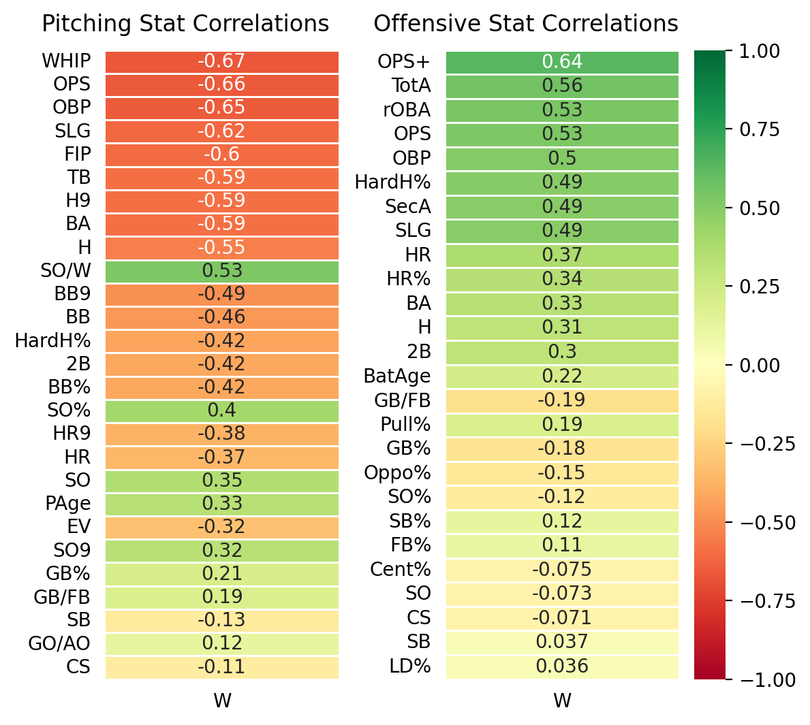
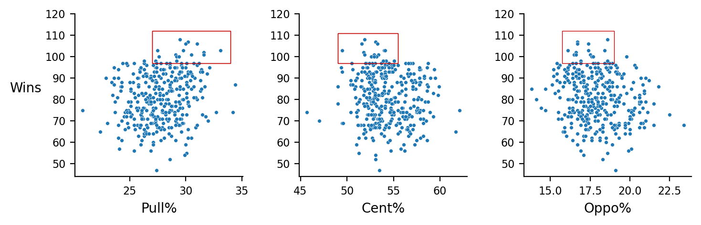
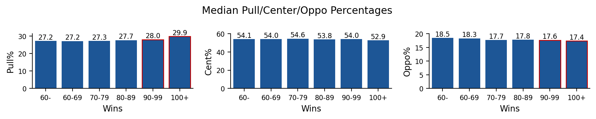
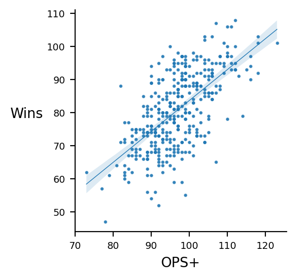
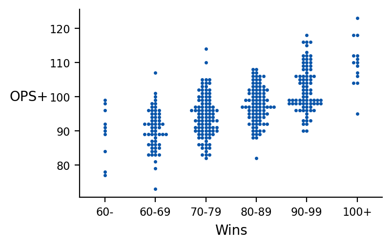
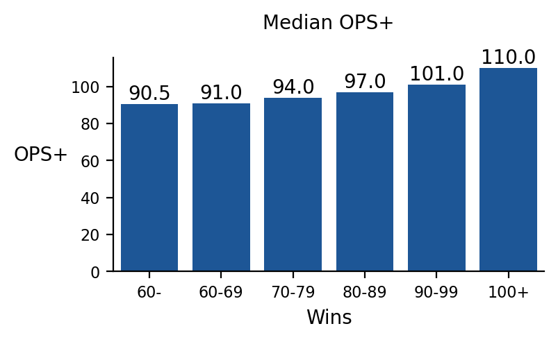

# Baseball Analysis

This repo is made to provide baseball data to perform analysis, (statistical) tests/simulations, and (ML) modeling.

[Project Ideas](#project-ideas)    
    
[Steps to contribute](#steps-to-contribute)    

**Projects:**
- **[Project 1](#project1): Predicting Team Wins + EDA**
    
## Acquire Data

[See Data Dictionary](#date-dictionary)

- Used Selenium to read mlb team and player stats from [Baseball Reference](https://www.baseball-reference.com)

Note on the data: 
- There are only 30 teams, so although there are lots of features (stats), there can only be so many rows of data, as each row represents the team's stats for the year. The amount of rows is 30 times the number of years.
- Players' stats, on the other hand, can offer thousands of rows to analyze.
- 2020 and 2023 data don't offer a full season's worth of stats, so these are left out, but can be accessed with the functions in `acquire.py`

---

## Project 1: Predicting MLB Team Wins + Analyzing Stats' Relations to Team Wins

**Description:**
- In this project, **team pitching stats** and **team batting stats** are used to see which stats lead to more wins. After finding the features that predict wins the most, regression models will be made to predict team wins in a season.

**Goals:**

- EDA: 
    - gain insights on stats the are important for wins
    - visualize insights
- Modeling:
    - build a machine learning (ML) regression model that can predict team wins in a season based on the team stats from that year
    - evaluate the best regression model for insights
- Features: MLB stats that are not calculated off wins or runs
- Target: team wins (continuous target)

### Data Analysis (EDA)

Data is split into training and test data. Analysis is performed on training data to avoid bias and data leakage during modeling. 

Test data is separated to test ML regression models later in the project.

**Which features correlate most to wins?**

**Note:** Only analyzed stats that are not calculated off wins (`W`) or runs (`R`), which will have an obvious bias towards wins.

Insights:

- Pitching stats that predict wins: `OPS`, `WHIP`, `FIP`
- Offensive stats that predict wins: `OPS+`, `TotA`, `rOBA`, and hard hits (`HardH%`)
- Pulling more hits leads to more wins than hitting to the opposite field.
- Pitching stats overall correlate more to wins than offensive stats

**1. Teams that pull the ball win more than those that don't.**

**2. OPS/OPS+ lead to more wins**

    

    

    

### Machine Learning Models: Regression

Baseline Model:

- `sklearn`'s `DummyRegressor`, which makes a constant prediction equal to the average team wins in a season.
- Model predictions are off by about 13 wins, on average, and explain none of the variance.

Best Regression Model: Linear Regression

- Model predictions are off by about 6 wins, on average, and explain 77% of the variance.

| Model              | $R^2$   |  RMSE     |
| :----------------- | -------- | -------- |
| Baseline           |  0.0     |  12.8    |
| Linear Regression  |  0.77    |  6.2     |

- $R^2$ (R-squared): proportion of variance in wins explained by the model
- RMSE (Root Mean Squared Error):  average prediction error of the model

|           |   Scaled Coeffs   |	Unscaled Coeffs  |
| --------- | ----------------- | ------------------ |
|OPS+	    | 26.89        |           0.54 |
|HR_bat	    | 16.30    	|           0.075 |
|BatAge	    | 8.28	        |           1.02 |
|WHIP	    | -25.76     	|         -53.01 |
|HR_pit	    | -23.64	    |          -0.11 |
|PAge	    | 1.90	        |           0.24 |
|Intercept	| 79.47     	|          79.47 |

The model's scaled coefficients tell us which features impact the model's predictions most. These can be thought of as wins added for having the maximum number of that feature rather than the minimum. So if the maximum number of home runs hit in a season is 200 and the minimum is 100, the model adds 26.89 more wins for a team if they have 200 home runs rather than 100.

The model's unscaled coefficients tell us how many wins are added or subtracted for number of units:

|     |   Wins Added per Unit |    Unit   |
|-----|-----------------------|-----------|
|OPS+ |           5.4         |  10 points |
|HRs hit |        .75         |      10 HRs |
|Batters age |      1.02      |      1 yr |
|WHIP  |          -5.5        |  .10   |
|HRs allowed|    -1.1        |        10 HRs |
|Pitchers age |    .24        |       1 yr      |
|Intercept    |   79.4        |                 |

### Conclusions and Insights

##### Summary

Analysis
- Batting stats that predict wins:
    - `OPS+`, `TotA`, `rOBA`
- Pitching stats that predict wins:
    - `OPS`, `WHIP`, `FIP`
- Pulled hits leads to more wins than not
- Pitching stats correlate more to wins than offensive stats

Modeling
- Baseline model predictions were off by 12.8 (RMSE) wins, on average, and explained 0 ($R^2$) of the variance.
- Best model was a linear regression model. Predictions were off by 6.2 wins, on average, and explained 77% of the variance in wins.

##### Recommendations
- Use the linear regression model to predict team wins from a past season based on their stats to see how 
- Recognize value in advanced and sabermetric stats like `OPS+`, `TotA`, `rOBA`, etc. that predict wins better than traditional stats like `BA`, `HR`, `H`. 
- While it is a unique skill for a hitter to hit the ball in any direction, recognize that this skill may not be as valuable as other skills, like being able to consistently hit the ball hard and draw walks.

##### Next Steps
- Analyze player data. Turn one of the important stats, like `OPS`, into the target variable and see which player stats and features drive this target.
- Investigate runs scored in a season and see if I can predict this number.
- Find groups/categories of players and find value and insights in these groups though clustering.

[Back to top](#top)

---

## Data Dictionary

**Team Batting Stats:**

| Stat    | Definition                                 | Stat    | Definition                      |
|:--------|:-------------------------------------------|:--------|:------------------------------------|
| year    | Season                                     | #Bat    | Number of batters           |
| W       | Wins                                       | L       | Losses                       |
| W-L%    | Win-loss percentage                        | Tm      | Team name                      |
| G       | Games played                               | PA      | Plate appearances             |
| AB      | At-bats                                    | R       | Runs scored                      |
| H       | Hits                                       | 2B      | Doubles                           |
| 3B      | Triples                                    | HR      | Home runs                     |
| RBI     | Runs batted in                             | SB      | Stolen bases                   |
| CS      | Caught stealing                            | BB      | Walks                             |
| SO      | Strikeouts                                 | BA      | Batting average                  |
| OBP     | On-base percentage $\frac{H + BB + HBP}{AB + BB + HBP + SF}$  | SLG     | Slugging percentage $\frac{TB}{AB}$  |
| OPS     | On-base plus slugging                       | OPS+    | Adjusted OPS                  |
| TB      | Total bases                                | GDP     | Grounded into double play           |
| HBP     | Hit by pitch                               | SH      | Sacrifice hits                  |
| SF      | Sacrifice flies                            | IBB     | Intentional walks                 |
| LOB     | Left on base                               | rOBA    | Reference-weighted on-base average, a measure of a player's offensive contributions  |
| BAbip   | Batting average on balls in play $\frac{H - HR}{AB - SO - HR + SF}$ | Rbat+   | Adjusted runs above average, batting runs as computed for WAR  |
| ISO     | Isolated power $\frac{TB - H}{AB}$          | HR%     | Home run percentage $\frac{HR}{PA}$   |
| SO%     | Strikeout percentage     $\frac{SO}{PA}$    | BB%     | Walk percentage  $\frac{BB}{PA}$     |
| EV      | Exit velocity                              | HardH%  | Percentage of hard-hit balls     |
| LD%     | Line drive percentage                      | GB%     | Ground ball percentage       |
| FB%     | Fly ball percentage                        | GB/FB   | Ground ball to fly ball ratio     |
| Pull%   | Percentage of pulled balls                  | Cent%   | Percentage of balls hit to center field|
| Oppo%   | Percentage of balls hit to opposite field   | WPA     | Win probability added    |
| cWPA    | Championship win probability added      | RE24    | Run expectancy based on 24 base-out states|
| RS%     | Percentage of runs scored                   | SB%     | Stolen base success rate       |
| XBT%    | Extra bases taken percentage     | Outs    | Total outs made $(AB - H) + GIDP + SF + SH + CS$   |
| RC      | Runs created                               | RC/G    | Runs created per game        |
| AIR     | Measure of amount played in hitter-friendly setting  | lgBA    | Adjusted batting average |
| lgOBP   | Adjusted on-base percentage                  | lgSLG   | Adjusted slugging percentage  |
| lgOPS   | Adjusted on-base plus slugging                | OWn%    | Offensive winning percentage, percentage of games a team with nine of this player batting would win |
| BtRuns  | Adjusted Batting Runs                 | BtWins  | Adjusted Batting Wins |
| TotA | Total chances in the field $\frac{TB + HBP + BB + SB - CS}{AB - H + CS + GIDP}$ | SecA | Secondary average $\frac{TB - H + BB + SB - CS}{AB}$ |
| PwrSpd  | Power-speed number  $\frac{2 x HR x SB}{SB + HR}$               |

**Player Batting Stats:**

| Stat         | Definition                                            | Stat         | Definition        |
|:-------------|:------------------------------------------------------|:-------------|:------------------|
| year         | Season                                                | id           | Player ID         |
| Name         | Player Name                                     | Bats         | Bats right/left/switch |
| Age          | Player Age                                            | Tm           | Team             |
| Lg           | League                                                | G            | Games played     |
| PA           | Plate appearances                                     | AB           | At-bats           |
| R            | Runs scored                                           | H            | Hits             |
| 2B           | Doubles                                               | 3B           | Triples          |
| HR           | Home runs                                             | RBI          | Runs batted in    |
| SB           | Stolen bases                                          | CS           | Caught stealing   |
| BB           | Walks                                                 | SO           | Strikeouts       |
| BA           | Batting average                                       | OBP          | On-base percentage  |
| SLG          | Slugging percentage                                | OPS          | On-base plus slugging |
| OPS+         | OPS+                                                  | TB           | Total bases       |
| GDP          | Grounded into double play                              | HBP          | Hit by pitch   |
| SH           | Sacrifice hits                                        | SF           | Sacrifice flies   |
| IBB          | Intentional walks                                     | Pos Summary  | Positions played  |
| Outs         | Total outs made                                       | RC           | Runs created    |
| RC/G         | Runs created per game | AIR          | Measure of amount played in hitter-friendly setting|
| BAbip | Batting average on balls in play $\frac{H - HR}{AB - SO - HR + SF}$  | lgBA | Adjusted batting average |
| lgOBP        | League on-base percentage           | lgSLG        | League slugging percentage |
| lgOPS        | League on-base plus slugging    | OWn%         | Offensive winning percentage   |
| BtRuns       | Batting runs above average        | BtWins       | Batting wins above replacement    |
| TotA         | Total chances in the field                | SecA         | Secondary average          |
| ISO          | Isolated power                                        | PwrSpd       | Power-speed number |
| rOBA         | Reference-weighted on-base average                    | Rbat+        | Runs above average  |
| HR%          | Home run percentage                                 | SO%          | Strikeout percentage |
| BB%          | Walk percentage                                     | LD%          | Line drive percentage |
| GB%          | Ground ball percentage                                | FB%          | Fly ball percentage |
| GB/FB        | Ground ball to fly ball ratio         | Pull%        | Percentage of pulled balls  |
| Cent% | Percentage of balls hit to center field | Oppo%    | Percentage of balls hit to opposite field  |
| WPA          | Win probability added                 | cWPA         | Championship win probability added |
| RE24 | Run expectancy based on 24 base-out states           | RS%          | Percentage of runs scored |
| SB%          | Stolen base success rate                    | XBT%         | Extra bases taken percentage  |
| EV           | Exit velocity                               | HardH%       | Percentage of hard-hit balls |

**Team Pitching Stats:**

| Stat   | Definition                                         | Stat   | Definition               |
|:-------|:---------------------------------------------------|:-------|:-------------------------|
| year   | Year of the season                                 | Tm     | Team name        |
| #P     | Number of pitchers                                 | PAge   | Average age of pitchers   |
| RA/G   | Runs against per game                              | W      | Wins          |
| L      | Losses                                             | W-L%   | Win-loss percentage       |
| ERA    | Earned run average                                 | G      | Games played         |
| GS     | Games started                                      | GF     | Games finished      |
| CG     | Complete games                                     | tSho   | Team shutouts     |
| cSho   | Complete game shutouts                             | SV     | Saves          |
| IP     | Innings pitched                                    | H      | Hits allowed       |
| R      | Runs allowed                                       | ER     | Earned runs        |
| HR     | Home runs allowed                                  | BB     | Walks allowed        |
| IBB    | Intentional walks                                  | SO     | Strikeouts         |
| HBP    | Hit by pitch                                       | BK     | Balks           |
| WP     | Wild pitches                                       | BF     | Batters faced        |
| ERA+   | Adjusted ERA                                       | FIP    | Fielding Independent Pitching   |
| WHIP   | Walks plus hits per inning pitched                 | H9     | Hits per 9 innings      |
| HR9    | Home runs per 9 innings                            | BB9    | Walks per 9 innings    |
| SO9    | Strikeouts per 9 innings                           | SO/W   | Strikeout-to-walk ratio    |
| LOB    | Left on base                                      | BA     | Batting average against    |
| OBP    | On-base percentage against                        | SLG    | Slugging percentage against     |
| OPS    | On-base plus slugging against              | BAbip  | Batting average on balls in play against  |
| HR%    | Home run percentage against                       | SO%    | Strikeout percentage against  |
| BB%    | Walk percentage against                           | EV     | Exit velocity against           |
| HardH% | Percentage of hard-hit balls against               | LD%    | Line drive percentage against   |
| GB%    | Ground ball percentage against                    | FB%    | Fly ball percentage against     |
| GB/FB  | Ground ball to fly ball ratio against              | WPA    | Win probability added          |
| cWPA   | Championship win probability added        | RE24   | Run expectancy based on 24 base-out states |
| PAu    | Total plate appearances used by pitchers           | PA     | Plate appearances by pitchers     |
| AB     | At-bats by pitchers                                | 2B     | Doubles allowed               |
| 3B     | Triples allowed                                    | SB     | Stolen bases allowed          |
| CS     | Caught stealing allowed                            | TB     | Total bases allowed           |
| GDP    | Grounded into double play by pitchers              | SH     | Sacrifice hits by pitchers      |
| SF     | Sacrifice flies by pitchers                        | ROE    | Reached on error by pitchers    |
| Ptn%   | Pickoff percentage by pitchers           | SO-BB% | Strikeout-to-walk percentage by pitchers  |
| XBH%   | Extra-base hits percentage by pitchers | X/H%   | Extra-base hits to hits percentage by pitchers |
| GO/AO | Ground ball to fly ball ratio by pitchers | IP% | Percentage of team's innings pitched by pitchers|
| HR/FB  | Home run to fly ball ratio by pitchers  | IF/FB  | Infield fly ball to fly ball ratio by pitchers|
| Opp    | GIDP opportunities        | DP     | Double plays induced |
| %      | GIDP Percentage                                         |        |                               |

**Player Pitching Stats:**

| Stat   | Definition                                          | Stat   | Definition            |
|:-------|:----------------------------------------------------|:-------|:----------------------|
| year   | Year of the season                                  | id     | Player ID                     |
| Name   | Player Name                                         | Throws | Throwing hand                |
| Age    | Player Age                                          | Tm     | Team                        |
| Lg     | League                                              | W      | Wins                       |
| L      | Losses                                              | W-L%   | Win-loss percentage          |
| ERA    | Earned run average                                  | G      | Games played                    |
| GS     | Games started                                       | GF     | Games finished               |
| CG     | Complete games                                      | SHO    | Shutouts                    |
| SV     | Saves                                               | IP     | Innings pitched             |
| H      | Hits allowed                                        | R      | Runs allowed                 |
| ER     | Earned runs                                         | HR     | Home runs allowed           |
| BB     | Walks allowed                                       | IBB    | Intentional walks            |
| SO     | Strikeouts                                          | HBP    | Hit by pitch                   |
| BK     | Balks                                               | WP     | Wild pitches                  |
| BF     | Batters faced                                       | ERA+   | Adjusted ERA                 |
| FIP    | Fielding Independent Pitching                     | WHIP   | Walks plus hits per inning pitched |
| H9     | Hits per 9 innings                                  | HR9    | Home runs per 9 innings      |
| BB9    | Walks per 9 innings                                 | SO9    | Strikeouts per 9 innings       |
| SO/W   | Strikeout-to-walk ratio                             | BA     | Batting average against         |
| OBP    | On-base percentage against                         | SLG    | Slugging percentage against    |
| OPS    | On-base plus slugging against           | BAbip  | Batting average on balls in play against |
| HR%    | Home run percentage against                        | SO%    | Strikeout percentage against    |
| BB%    | Walk percentage against                            | LD%    | Line drive percentage against   |
| GB%    | Ground ball percentage against                     | FB%    | Fly ball percentage against   |
| GB/FB  | Ground ball to fly ball ratio against               | WPA    | Win probability added         |
| cWPA   | Championship win probability added      | RE24   | Run expectancy based on 24 base-out states  |
| EV     | Exit velocity against                            | HardH% | Percentage of hard-hit balls against |

[Back to top](#top)

**Steps to contribute:**
- Option 1;
    1. pull files from remote `master` branch to update your local repo (`git pull origin master`)
    2. create a new local branch and create/edit files (`git checkout -b [your_new_branch]`)
    3. `add/commit` files in that branch
    4. push branch to remote repo for lead to review and merge onto remote `master` branch (`git push origin [your_new_branch]`)
    5. move back to local `master` branch and repeat steps 1-4 to contribute more (`git checkout master`)
   
- Option 2:
    1. pull files from remote `master` branch to update your local repo (`git pull origin master`)
    2. create new notebooks and python files with work you want to contribute.
        -  **don't change main files**
    3. lead will review files to add to "main files"
    4. `add/commit/push` as usual
    5. run step 1 to update local repo, repeat steps 2-4 to contribute more.
    
[Back to top](#top)

Possible project goals:

- [x] Which stats lead to more wins (team wins)? (EDA)
    - Can we build a regression model to predict team wins in a season?
- [ ] Which stats correlate most to runs scored (team runs)? (EDA)
    - Can we build a regression model to predict team runs in a season?
- [ ] Which stats correlate most to other important stats, including player stats? (EDA)
    - Can we build a regression model to predict these stats?
- [ ] Can we find common groups of players and find value and insights from those groups?
    
[Back to top](#top)